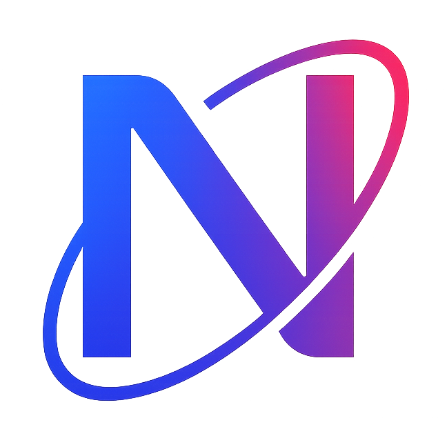

[](https://github.com/Thibault-Monnier/neutronium/actions/workflows/build.yml) [](https://github.com/Thibault-Monnier/neutronium/actions/workflows/test.yml) [](https://codecov.io/gh/Thibault-Monnier/neutronium)

# Neutronium

Neutronium is a lightweight C-like programming language built as an educational project.

> **Disclaimer:** The Neutronium compiler works on **Linux only**, and the following instructions are tailored for
> Linux (Ubuntu) environments.

<p>
  <br>
  <a href="https://github.com/Thibault-Monnier/neutronium/releases/latest">
  📦 <strong>Latest Release</strong>
  </a>
</p>

## Setup

Clone this repository and set it up by running:

```bash
git clone https://github.com/Thibault-Monnier/neutronium.git
cd neutronium
chmod +x cmake-build.sh
chmod +x compile.sh
chmod +x run.sh
chmod +x test.sh
```

To install the required dependencies, run:

```bash
sudo apt update
sudo apt install build-essential cmake ninja-build nasm
```

Make sure your `cmake` version is at least 3.28.

## Compile and Run

You can use the following shell scripts to compile and run the Neutronium compiler:

```bash
./cmake-build.sh # Reconfigure cmake + build the compiler
./compile.sh <path-to-source-file> [OPTIONS] # Compile a Neutronium source file
./run.sh <path-to-source-file> [OPTIONS] # Run the generated machine code
```

Each script calls the previous one, so you never need to run several of them.

As of October 2025, the compiler always writes the generated executable to `neutro/out`.

> 💡 Tip: you can write your scripts in the scripts/ directory, which is ignored by version control.

## Run Tests

To build and run the test suite, run:

```bash
./test.sh
```

## Contributing

Contributions are welcome! Feel free to open an issue or to submit a pull request.

## Language

Refer to the [language documentation](docs/language.md) for syntax.

